# Gorkheavy-Lite: Multi-Model AI Orchestration on K3s

A lightweight Kubernetes-based AI ensemble system that orchestrates multiple small language models to deliver optimized responses. The system uses an intelligent judge-based selection mechanism to choose the best answer from parallel model executions.

## Table of Contents

- [Architecture Overview](#architecture-overview)
- [Features](#features)
- [Infrastructure Setup](#infrastructure-setup)
  - [1. Proxmox Hypervisor Deployment](#1-proxmox-hypervisor-deployment)
  - [2. Ubuntu VM Provisioning](#2-ubuntu-vm-provisioning)
  - [3. Ubuntu Configuration for K3s](#3-ubuntu-configuration-for-k3s)
  - [4. System Optimization](#4-system-optimization)
  - [5. K3s Cluster Deployment](#5-k3s-cluster-deployment)
- [Application Architecture](#application-architecture)
  - [Container Design](#container-design)
  - [Model Orchestration](#model-orchestration)
  - [Kubernetes Resources](#kubernetes-resources)
- [Data Flow](#data-flow)
- [Complete System Architecture](#complete-system-architecture)
- [Deployment](#deployment)
- [Usage](#usage)
- [Troubleshooting](#troubleshooting)
- [Performance Considerations](#performance-considerations)
- [Future Enhancements](#future-enhancements)

## Architecture Overview

Gorkheavy-Lite is a distributed AI system that combines five specialized language models orchestrated through Kubernetes. The system processes user queries through a multi-stage pipeline: prompt optimization, parallel model inference, and intelligent answer selection.

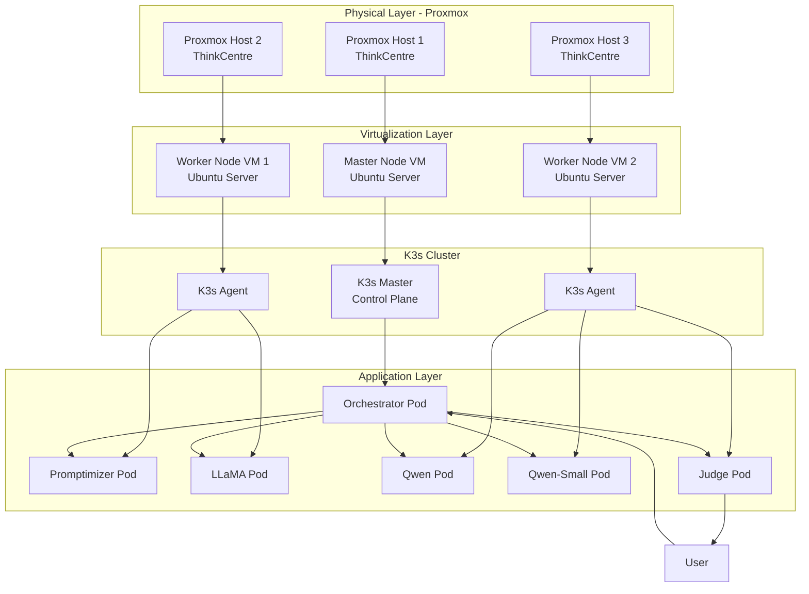

## Features

- **Multi-Model Ensemble**: Leverages 5 specialized models for diverse reasoning capabilities
- **Intelligent Answer Selection**: Judge model evaluates and selects the best response
- **Parallel Processing**: Async execution of multiple models simultaneously
- **Prompt Optimization**: Automatic query refinement before processing
- **Conversation Memory**: Maintains context of last 5 interactions
- **Kubernetes Native**: Fully containerized with health checks and resource management
- **Lightweight**: Optimized for edge deployment with small models (350M - 1.5B parameters)
- **High Availability**: Topology spread constraints for resilient pod distribution

## Infrastructure Setup

### 1. Proxmox Hypervisor Deployment

Proxmox VE provides the bare-metal virtualization layer for the K3s cluster.

#### Installation Steps

1. **Download Proxmox VE ISO**
   - Visit: https://www.proxmox.com/en/downloads
   - Download the latest Proxmox VE ISO image

2. **Create Bootable USB**

   **Windows (using Rufus):**
   ```
   - Download Rufus from https://rufus.ie/
   - Insert USB drive (minimum 2GB)
   - Select Proxmox ISO
   - Click "Start"
   ```

   **Linux:**
   ```bash
   # Replace /dev/sdX with your USB device (use lsblk to identify)
   sudo dd if=proxmox-ve_*.iso of=/dev/sdX bs=1M status=progress
   sudo sync
   ```

3. **Install Proxmox on Target Hardware**
   - Insert USB into ThinkCentre machine
   - Boot from USB (typically press F12/F2/Del during startup)
   - Follow installation wizard:
     - Select target disk
     - Set timezone
     - Create administrator password
     - Configure network (use static IP in range x.x.x.200+)

4. **Access Proxmox Web Interface**
   - Navigate to: `https://<proxmox-ip>:8006/`
   - Login with `root` and your password
   - Accept the security certificate warning

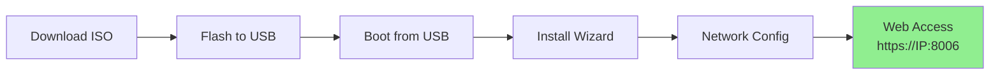

**Why Proxmox?** Provides enterprise-grade virtualization with a web-based management interface, snapshots, and cluster support - ideal for bare-metal Kubernetes deployments.

---

### 2. Ubuntu VM Provisioning

Each VM in the cluster requires Ubuntu Server for K3s compatibility.

#### VM Creation Steps

1. **Upload Ubuntu ISO to Proxmox**
   - Download Ubuntu Server ISO: https://ubuntu.com/download/server
   - In Proxmox web UI:
     - Navigate to: **Datacenter > Storage (local) > ISO Images**
     - Click **Upload**
     - Select Ubuntu ISO file

2. **Create Virtual Machine**

   Click **Create VM** button and configure:

   | Setting | Master Node | Worker Node |
   |---------|------------|-------------|
   | **General** | Name: `k3s-master` | Name: `k3s-worker-N` |
   | **OS** | Ubuntu Server ISO | Ubuntu Server ISO |
   | **System** | Default (UEFI + TPM optional) | Default |
   | **Disks** | 32GB+ | 32GB+ |
   | **CPU** | 4 cores | 4 cores |
   | **Memory** | 8192 MB | 8192 MB |
   | **Network** | vmbr0, **Firewall: OFF** | vmbr0, **Firewall: OFF** |

3. **Start VM and Complete Ubuntu Installation**
   - Start the VM
   - Follow Ubuntu installer:
     - **CRITICAL**: Use identical username across all VMs
     - Set unique hostname (e.g., `k3s-master`, `k3s-worker-1`)
     - Configure static IP (x.x.x.200+)
     - Enable OpenSSH server
     - Skip additional packages

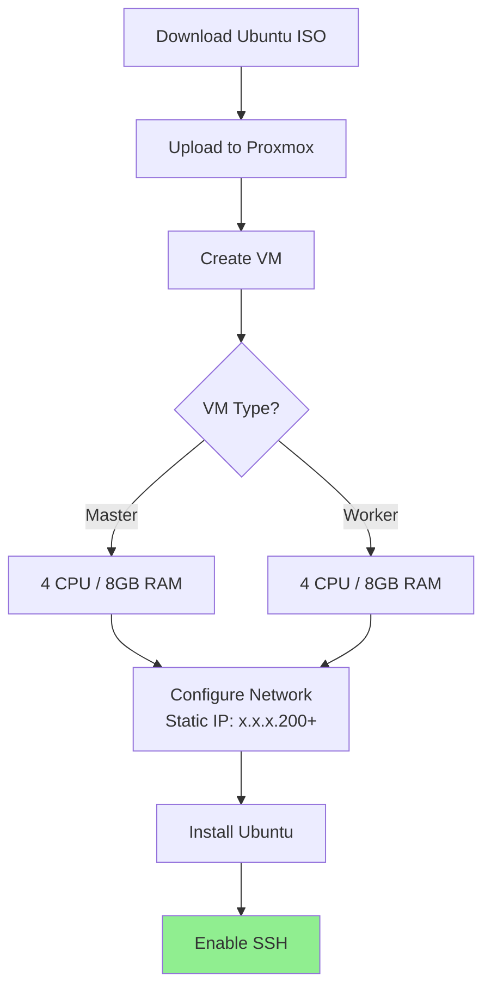

**Why These Resources?** Each AI model pod requires 512MB-2GB RAM. Resource allocation ensures models don't compete for memory, preventing OOM kills.

---

### 3. Ubuntu Configuration for K3s

Proper node configuration is critical for Kubernetes stability.

#### Initial Network Configuration

If not set during installation:

```bash
# Edit netplan configuration
sudo vim /etc/netplan/50-cloud-init.yaml
```

**Configuration template:**
```yaml
network:
  version: 2
  ethernets:
    eth0:  # Your interface name (check with 'ip a')
      dhcp4: no
      addresses:
        - <NODE_IP>/24  # e.g., 192.168.1.201/24
      gateway4: <GATEWAY_IP>
      nameservers:
        addresses:
          - 8.8.8.8
          - 8.8.4.4
```

Apply configuration:
```bash
sudo netplan apply
```

#### SSH Hardening

1. **Configure SSH for Key-Based Authentication**

```bash
# Enable and start SSH service
sudo systemctl enable ssh
sudo systemctl start ssh
sudo systemctl status ssh
```

2. **Generate SSH Key Pair (ED25519 recommended)**

```bash
# Generate key on each node
ssh-keygen -t ed25519 -C "k3s-cluster-key"

# Press Enter for default location (~/.ssh/id_ed25519)
# Set a strong passphrase or leave empty for automation
```

3. **Distribute Keys to All Nodes**

```bash
# From master node, copy key to each worker
ssh-copy-id username@192.168.1.202  # worker-1
ssh-copy-id username@192.168.1.203  # worker-2

# From each worker, copy key to master
ssh-copy-id username@192.168.1.201  # master

# Test passwordless login
ssh username@192.168.1.202
```

4. **Disable Password Authentication**

```bash
sudo vim /etc/ssh/sshd_config
```

Set:
```
PasswordAuthentication no
PubkeyAuthentication yes
```

Restart SSH:
```bash
sudo systemctl restart ssh
```

#### Configure Passwordless Sudo

Required for automated K3s operations:

```bash
sudo visudo
```

Add at the end:
```
<username> ALL=(ALL) NOPASSWD: ALL
```

**Save and exit** (Ctrl+X, then Y)

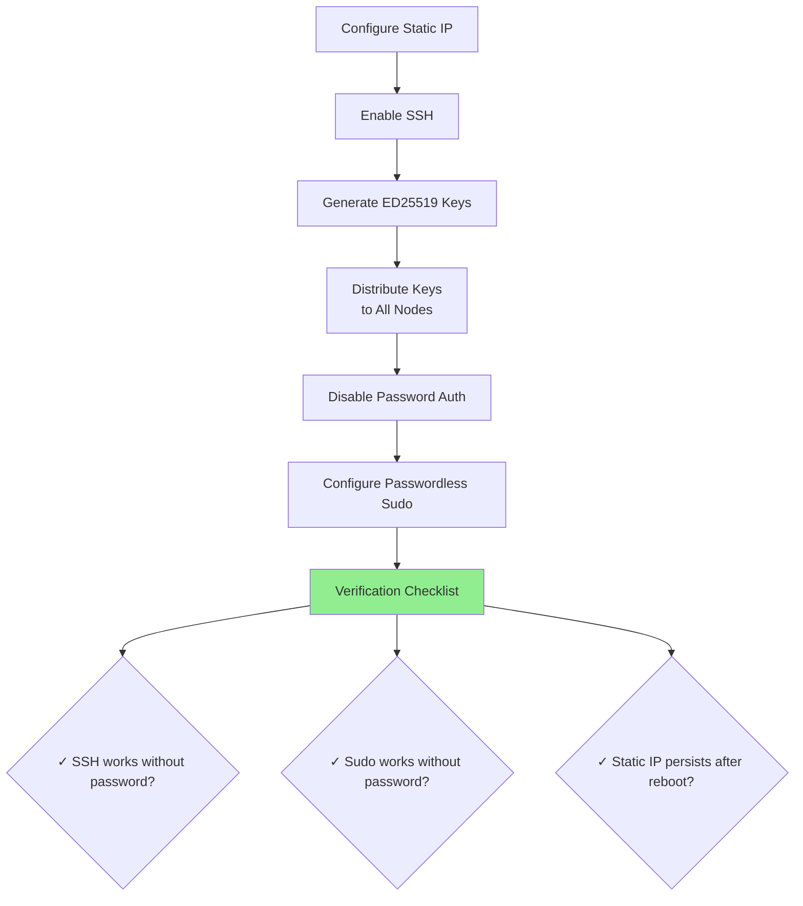

---

### 4. System Optimization

Prepare nodes for Kubernetes requirements.

#### Disable Firewall (or Configure Ports)

**Option A: Disable (simplest for private networks)**
```bash
sudo ufw disable
sudo ufw status  # Should show "inactive"
```

**Option B: Configure Required Ports**
```bash
sudo ufw allow 6443/tcp   # K3s API server
sudo ufw allow 10250/tcp  # Kubelet metrics
sudo ufw allow 8472/udp   # Flannel VXLAN
sudo ufw enable
```

#### Disable Swap (Kubernetes Requirement)

Kubernetes requires swap to be disabled for proper pod memory management:

```bash
# Disable swap immediately
sudo swapoff -a

# Make permanent - comment swap line in fstab
sudo vim /etc/fstab
# Comment out the line containing 'swap' by adding # at the beginning
# Example: # /swap.img none swap sw 0 0

# Verify swap is off
free -h  # Swap line should show 0B
```

**Why disable swap?** Kubernetes uses cgroups for precise memory limits. Swap interferes with OOM detection and can cause unpredictable pod behavior.

#### Time Synchronization

Critical for certificate validation and log correlation:

```bash
# Check current time sync status
timedatectl status

# Enable NTP synchronization
sudo timedatectl set-ntp true

# Verify
timedatectl status
# Should show: "System clock synchronized: yes"
```

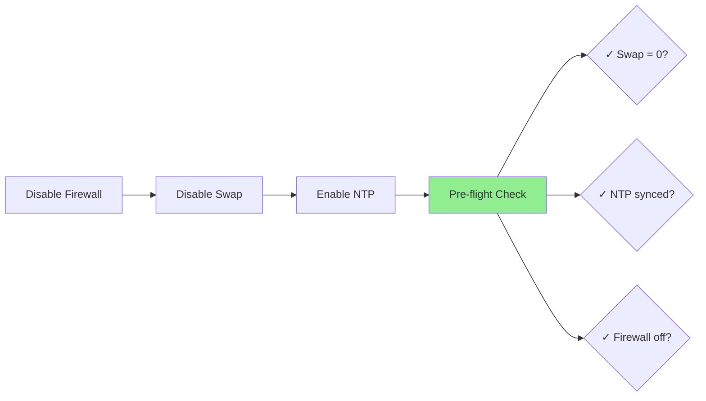

---

### 5. K3s Cluster Deployment

K3s is a lightweight Kubernetes distribution perfect for edge deployments.

#### Master Node Installation

On the master node:

```bash
# Install K3s server
curl -sfL https://get.k3s.io | sh -

# Wait for node to be ready
sudo k3s kubectl get nodes

# Retrieve the node token (needed for workers)
sudo cat /var/lib/rancher/k3s/server/node-token
```

**Expected output:**
```
K10abc123def456...::server:789xyz
```

Save this token - you'll need it for worker nodes.

#### Worker Node Installation

On each worker node:

```bash
# Replace <MASTER_IP> and <NODE_TOKEN> with actual values
curl -sfL https://get.k3s.io | K3S_URL=https://<MASTER_IP>:6443 \
  K3S_TOKEN=<NODE_TOKEN> sh -
```

**Example:**
```bash
curl -sfL https://get.k3s.io | K3S_URL=https://192.168.1.201:6443 \
  K3S_TOKEN=K10abc123def456...::server:789xyz sh -
```

#### Cluster Verification

On the master node:

```bash
# View all nodes
sudo k3s kubectl get nodes

# Expected output:
# NAME           STATUS   ROLES                  AGE   VERSION
# k3s-master     Ready    control-plane,master   5m    v1.28.x+k3s1
# k3s-worker-1   Ready    <none>                 2m    v1.28.x+k3s1
# k3s-worker-2   Ready    <none>                 1m    v1.28.x+k3s1

# View system pods
sudo k3s kubectl get pods -A
```

All pods should show `Running` status.

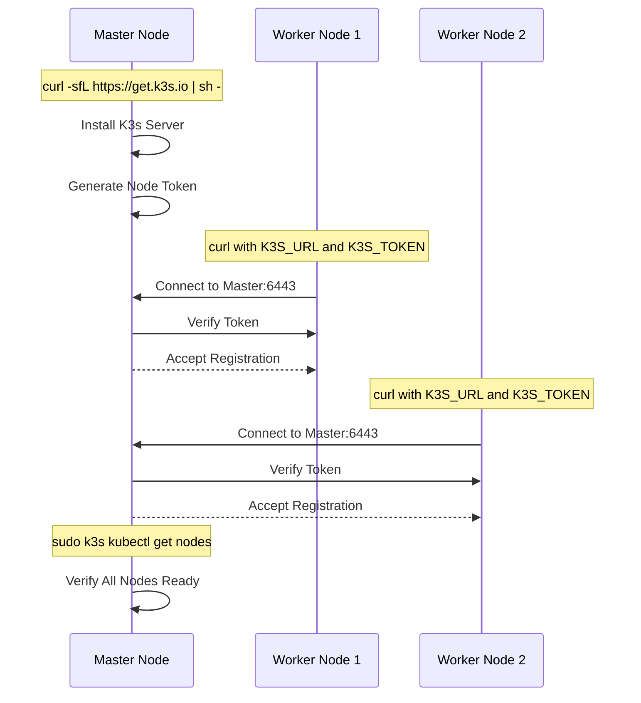

**Troubleshooting Tip:** If nodes show `NotReady`, check:
- `sudo systemctl status k3s` (master)
- `sudo systemctl status k3s-agent` (workers)
- Firewall rules
- Network connectivity: `ping <master-ip>` from workers

---

## Application Architecture

### Container Design

The system consists of 6 containerized components, all built from lightweight base images.

#### AI Model Containers

All five model containers follow an identical architecture pattern:

**Common Base Structure:**
```dockerfile
FROM python:3.11-slim
RUN apt-get update && apt-get install -y curl tini
RUN curl -fsSL https://ollama.com/install.sh | sh

ENV MODEL_NAME=<specific-model>
ENV OLLAMA_HOST=0.0.0.0:11434
EXPOSE 11434

# Startup script: serve → pull model → wait
```

| Container | Model | Size | Purpose |
|-----------|-------|------|---------|
| **promptimizer** | granite4:350m | 350M params | Query optimization - rewrites user input for clarity |
| **llama** | llama3.2:1b | 1B params | General-purpose reasoning and broad knowledge |
| **qwen** | qwen2.5-coder:1.5b | 1.5B params | Code generation and technical queries |
| **qwen-small** | qwen3:0.6b | 600M params | Fast responses with low latency |
| **judge** | gemma3:1b | 1B params | Answer evaluation and selection |

**Why these models?**
- **Small footprint**: Total ~4.5GB models, suitable for edge hardware
- **Specialized strengths**: Each model excels in different domains
- **Parallelizable**: 1B models complete inference in 2-5 seconds on CPU
- **Diversity**: Different architectures (LLaMA, Qwen, Gemma, Granite) reduce correlated errors

#### Orchestrator Container

```dockerfile
FROM python:3.11-slim
RUN apt-get update && apt-get install -y curl tini
RUN pip install --no-cache-dir aiohttp
COPY final_script.py .
CMD ["python", "-u", "final_script.py"]
```

**Purpose**: Coordinates all model interactions using async Python (aiohttp) for concurrent API calls.

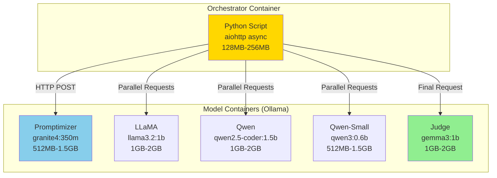

---

### Model Orchestration

The orchestration logic in `final_script.py` implements a sophisticated multi-stage processing pipeline.

#### Workflow Architecture

```python
# API Endpoints (Kubernetes DNS)
api_endpoints = {
    "promptimizer": "http://promptimizer:11434/api/generate",
    "llama": "http://llama:11434/api/generate",
    "qwen": "http://qwen:11434/api/generate",
    "qwen_small": "http://qwen-small:11434/api/generate",
    "judge": "http://judge:11434/api/generate",
}
```

**Key Features:**
1. **Service Discovery**: Uses Kubernetes ClusterIP services (DNS-based)
2. **Async Execution**: `aiohttp` for non-blocking HTTP
3. **Parallel Processing**: `asyncio.gather()` for concurrent model calls
4. **Error Handling**: Try/except with `return_exceptions=True`
5. **Conversation Memory**: Maintains last 5 message contexts

#### Processing Pipeline

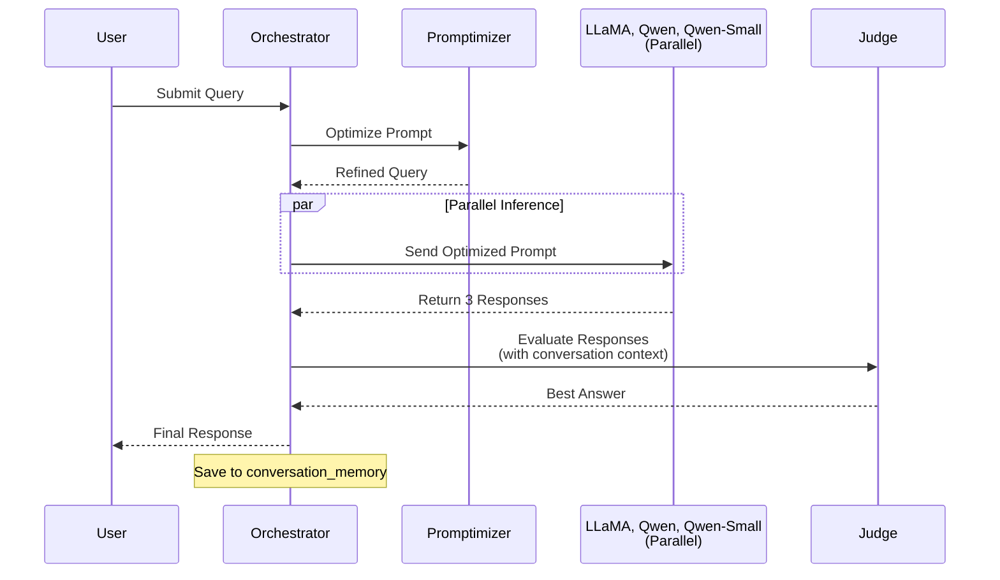

#### Code Flow Breakdown

**Stage 1: Prompt Optimization**
```python
async def promptimizer(session, user_input):
    # Rewrites query for clarity and conciseness
    # Example: "What's the weather?" → "Provide current weather conditions"
```

**Stage 2: Parallel Model Execution**
```python
async def send_all_models(session, user_input):
    optimized_prompt = await promptimizer(session, user_input)

    # Execute 3 models concurrently
    responses = await asyncio.gather(
        send_qwen_small(session, optimized_prompt),  # Fast, lightweight
        send_qwen(session, user_input),              # Code-focused
        send_llama(session, user_input),             # General reasoning
        return_exceptions=True
    )
    return responses  # Returns in 2-5 seconds total (not 6-15)
```

**Why parallel?** Sequential execution would take 3x longer. Async allows models to process simultaneously on different nodes.

**Stage 3: Answer Selection**
```python
async def send_judge(session, user_input, responses):
    # Evaluates based on:
    # - Correctness
    # - Completeness
    # - Clarity
    # - Usefulness
    # - Conversation context (last 5 messages)
```

**Conversation Memory:**
```python
conversation_memory = []  # Rolling buffer

# After each interaction:
conversation_memory.append({"role": "judge", "content": response})
context = conversation_memory[-5:]  # Last 5 messages for context
```

---

### Kubernetes Resources

The `script_final.yaml` defines all cluster resources for the AI ensemble.

#### Resource Summary

| Component | Type | Replicas | CPU Request | Memory Request | CPU Limit | Memory Limit |
|-----------|------|----------|-------------|----------------|-----------|--------------|
| promptimizer | Deployment | 1 | 300m | 512Mi | 800m | 1.5Gi |
| llama | Deployment | 1 | 400m | 1Gi | 900m | 2Gi |
| qwen | Deployment | 1 | 400m | 1Gi | 900m | 2Gi |
| qwen-small | Deployment | 1 | 250m | 512Mi | 600m | 1.5Gi |
| judge | Deployment | 1 | 400m | 1Gi | 900m | 2Gi |
| orchestrator | Deployment | 1 | 100m | 128Mi | 200m | 256Mi |

**Total Cluster Requirements:**
- CPU: 1.85 cores (requests) / 4.2 cores (limits)
- Memory: 4.1GB (requests) / 9.8GB (limits)

#### Advanced Kubernetes Features

**1. Topology Spread Constraints**
```yaml
topologySpreadConstraints:
- maxSkew: 1
  topologyKey: kubernetes.io/hostname
  whenUnsatisfiable: DoNotSchedule
  labelSelector:
    matchLabels:
      ensemble: opus-ai-system
```

**Purpose**: Distributes pods evenly across worker nodes. Prevents all models from landing on one node (which would cause resource contention).

**2. Node Affinity**
```yaml
affinity:
  nodeAffinity:
    requiredDuringSchedulingIgnoredDuringExecution:
      nodeSelectorTerms:
      - matchExpressions:
        - key: node-role.kubernetes.io/control-plane
          operator: DoesNotExist
```

**Purpose**: Ensures pods only run on worker nodes, not the master. Protects control plane resources.

**3. Init Container for Service Readiness**
```yaml
initContainers:
- name: wait-for-services
  image: curlimages/curl:latest
  command:
  - sh
  - -c
  - |
    # Wait for all 5 model services to respond
    until curl -f http://promptimizer:11434/api/tags; do sleep 5; done
    until curl -f http://llama:11434/api/tags; do sleep 5; done
    # ... (qwen, qwen-small, judge)
    sleep 30  # Extra time for model loading
```

**Purpose**: Prevents orchestrator from starting until all model services are fully loaded. Avoids connection errors during startup.

**4. Health Probes**
```yaml
livenessProbe:
  httpGet:
    path: /api/tags
    port: 11434
  initialDelaySeconds: 60
  periodSeconds: 10
  failureThreshold: 3

readinessProbe:
  httpGet:
    path: /api/tags
    port: 11434
  initialDelaySeconds: 45
  periodSeconds: 5
```

**Purpose**:
- **Liveness**: Restarts pod if Ollama server crashes
- **Readiness**: Removes pod from service endpoints until model is loaded

#### Service Architecture

All model services use `ClusterIP` type (internal-only):

```yaml
apiVersion: v1
kind: Service
metadata:
  name: promptimizer
spec:
  selector:
    app: promptimizer
  ports:
  - port: 11434
    targetPort: 11434
  type: ClusterIP
```

**Why ClusterIP?** Models don't need external access. Only the orchestrator communicates with them via internal DNS (`http://promptimizer:11434`).

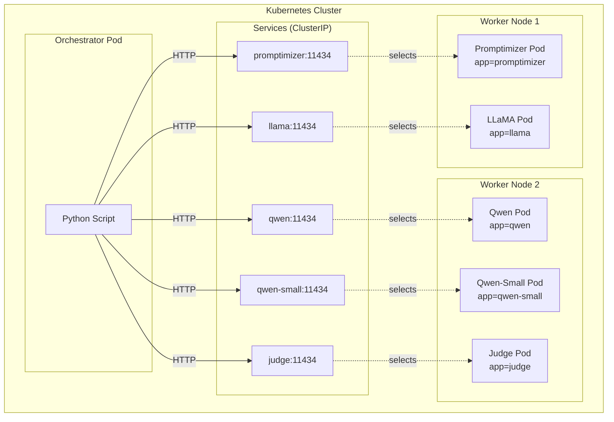

---

## Data Flow

This section illustrates the complete request/response journey through the system.

### Request Flow Diagram

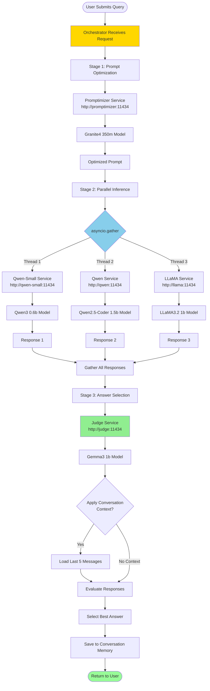

### Detailed Flow with Timing

**Response Timeline:**

Response times are highly dependent on hardware capabilities. The system uses CPU-based inference, and actual timing can vary significantly based on:
- CPU performance (cores, clock speed)
- Available RAM and memory bandwidth
- System load and concurrent processes
- Network latency between nodes

| Stage | Action | Notes |
|-------|--------|-------|
| 0 | User submits query | Entry point |
| 1 | Orchestrator processes | Minimal overhead |
| 2 | Promptimizer inference | Single model execution |
| 3 | Parallel model execution | 3 models run concurrently |
| 4 | Judge evaluation | Final answer selection |
| 5 | Return to user | Response delivered |

**Why parallelization matters:** Without async execution, Stage 3 would require sequential processing (3× longer). Async execution with `asyncio.gather()` reduces total time to the duration of the slowest model, not the sum of all three.

### Network Flow

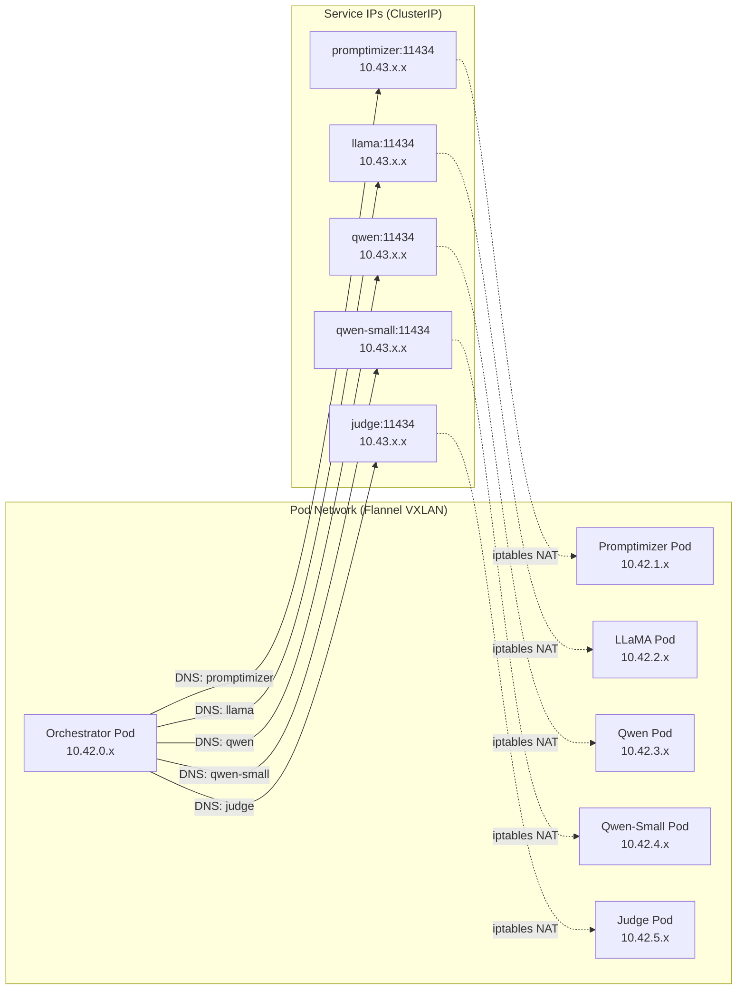

**How DNS resolution works:**
1. Orchestrator queries `http://promptimizer:11434`
2. CoreDNS resolves to ClusterIP (e.g., `10.43.100.50`)
3. Kube-proxy iptables rules route to pod IP (e.g., `10.42.1.15`)

---

## Complete System Architecture

This diagram shows the full stack from hardware to application logic.

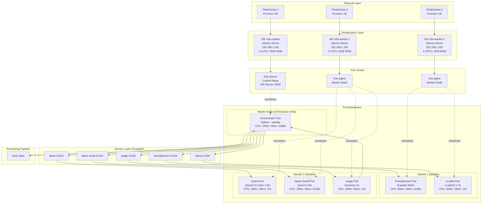

### Component Interaction Matrix

| Source | Target | Protocol | Port | Purpose |
|--------|--------|----------|------|---------|
| User | Orchestrator | stdin/stdout | N/A | Query submission |
| Orchestrator | Promptimizer | HTTP POST | 11434 | Prompt optimization |
| Orchestrator | LLaMA | HTTP POST | 11434 | General inference |
| Orchestrator | Qwen | HTTP POST | 11434 | Code-focused inference |
| Orchestrator | Qwen-Small | HTTP POST | 11434 | Fast inference |
| Orchestrator | Judge | HTTP POST | 11434 | Answer selection |
| Kubelet | All Pods | HTTP GET | 11434 | Health probes |
| Worker Nodes | Master | HTTPS | 6443 | K3s API |
| All Pods | CoreDNS | DNS | 53 | Service discovery |

---

## Deployment

Deploy the complete AI ensemble to your K3s cluster.

### Prerequisites Checklist

- [ ] K3s cluster running with 1 master + 2 workers
- [ ] All nodes show `Ready` status: `sudo k3s kubectl get nodes`
- [ ] Docker images available (pulled from Docker Hub or built locally)
- [ ] Minimum resources available:
  - 2 CPU cores free per worker
  - 5GB RAM free per worker

### Step 1: Verify Cluster Status

```bash
# On master node
sudo k3s kubectl get nodes
sudo k3s kubectl get pods -A

# Ensure all system pods are Running
```

### Step 2: Deploy the AI Ensemble

```bash
# Clone the repository (if not already)
git clone https://github.com/yourusername/gorkheavy-lite.git
cd gorkheavy-lite

# Apply the manifest
sudo k3s kubectl apply -f script_final.yaml
```

**Expected output:**
```
deployment.apps/promptimizer created
service/promptimizer created
deployment.apps/llama created
service/llama created
deployment.apps/qwen created
service/qwen created
deployment.apps/qwen-small created
service/qwen-small created
deployment.apps/judge created
service/judge created
deployment.apps/opus-orchestrator created
```

### Step 3: Monitor Deployment Progress

```bash
# Watch pod creation
sudo k3s kubectl get pods -w

# Check deployment status
sudo k3s kubectl get deployments

# View pod distribution across nodes
sudo k3s kubectl get pods -o wide
```

**Deployment typically takes approximately 1.5 minutes:**
1. Pods start and images are pulled
2. Ollama servers start and models load
3. Orchestrator init container waits for services
4. All pods reach `Running` state


---

## Usage

Interact with the AI ensemble through the orchestrator pod.

### Accessing the Orchestrator

```bash
# Get pod name and exec into it
sudo kubectl exec -it <pod_name> -- /bin/bash
```

### Example Interaction

```
YOU: What is Kubernetes?
Reply: Kubernetes is an open-source container orchestration platform...

YOU: Write a Python function to calculate factorial
Reply: Here's a recursive factorial function:

def factorial(n):
    if n == 0 or n == 1:
        return 1
    return n * factorial(n - 1)

YOU: exit
```

### Example Queries

**General Knowledge:**
```
YOU: Explain quantum computing in simple terms
```

**Code Generation:**
```
YOU: Create a REST API endpoint in FastAPI for user authentication
```

**Technical Troubleshooting:**
```
YOU: Why is my Kubernetes pod stuck in Pending state?
```

**Conversational (uses memory):**
```
YOU: What's the capital of France?
Reply: The capital of France is Paris.

YOU: What's its population?
Reply: Paris has a population of approximately 2.2 million in the city proper...
```

### Viewing Logs

**Orchestrator logs:**
```bash
sudo k3s kubectl logs -f deployment/opus-orchestrator
```

**Model logs:**
```bash
sudo k3s kubectl logs -f deployment/promptimizer
sudo k3s kubectl logs -f deployment/llama
sudo k3s kubectl logs -f deployment/qwen
```

### Scaling (Optional)

To increase replicas for load balancing:

```bash
# Scale model deployments
sudo k3s kubectl scale deployment/llama --replicas=2
sudo k3s kubectl scale deployment/qwen --replicas=2

# Verify
sudo k3s kubectl get pods -l ensemble=opus-ai-system
```

**Note:** Orchestrator should remain at 1 replica (stateful conversation memory).

---

## Troubleshooting

Common issues and their solutions.

### Issue 1: Pods Stuck in `Pending`

**Symptoms:**
```bash
NAME                  READY   STATUS    RESTARTS   AGE
llama-xxxxx          0/1     Pending   0          5m
```

**Diagnosis:**
```bash
sudo k3s kubectl describe pod <pod-name>
```

**Common Causes:**

**A. Insufficient Resources**
```
Events: 0/3 nodes are available: insufficient memory
```
**Solution:** Reduce resource requests in `script_final.yaml` or add more worker nodes.

**B. Node Not Ready**
```
Events: 0/3 nodes are available: node(s) not ready
```
**Solution:**
```bash
sudo k3s kubectl get nodes
# If NotReady, check:
sudo systemctl status k3s-agent  # on worker
journalctl -u k3s-agent -f
```

### Issue 2: Orchestrator Init Container Fails

**Symptoms:**
```bash
NAME                  READY   STATUS     RESTARTS   AGE
opus-orchestrator-x   0/1     Init:0/1   0          10m
```

**Diagnosis:**
```bash
sudo k3s kubectl logs <pod-name> -c wait-for-services
```

**Common Causes:**

**A. Model Service Not Responding**
```
Waiting for promptimizer...
Waiting for promptimizer...
```

**Solution:** Check if model pod is running:
```bash
sudo k3s kubectl get pods -l app=promptimizer
sudo k3s kubectl logs <promptimizer-pod>
```

If model pod is `Running` but init container still waiting, test connectivity:
```bash
sudo k3s kubectl exec -it <orch-pod> -c wait-for-services -- \
  curl -v http://promptimizer:11434/api/tags
```

### Issue 3: Models Failing to Load

**Symptoms:**
```bash
sudo k3s kubectl logs llama-xxxxx
Error: failed to pull model: context deadline exceeded
```

**Causes:**
- Slow network connection
- Insufficient disk space on node

**Solution:**

**A. Increase Pull Timeout**
Edit Dockerfile entrypoint script to add retry logic.

**B. Pre-pull Models**
```bash
# SSH into worker node
ssh username@worker-node-ip

# Pull models manually
sudo docker pull ollama/ollama:latest
sudo docker run -d --name ollama ollama/ollama
sudo docker exec -it ollama ollama pull llama3.2:1b
sudo docker exec -it ollama ollama pull qwen2.5-coder:1.5b
```

### Issue 4: Orchestrator Connection Errors

**Symptoms:**
```python
Promptimizer failed: Cannot connect to host promptimizer:11434
```

**Diagnosis:**
```bash
# Check if services exist
sudo k3s kubectl get services

# Check DNS resolution
sudo k3s kubectl run test --image=curlimages/curl -it --rm -- \
  nslookup promptimizer
```

**Solution:** Ensure service selector matches pod labels:
```bash
sudo k3s kubectl get pods --show-labels
# Should see: app=promptimizer

sudo k3s kubectl get service promptimizer -o yaml
# Should have: selector: app: promptimizer
```

### Issue 5: Pod Restarts / OOMKilled

**Symptoms:**
```bash
NAME          READY   STATUS      RESTARTS   AGE
qwen-xxxxx    0/1     OOMKilled   3          5m
```

**Cause:** Pod exceeds memory limit during model loading.

**Solution:** Increase memory limits in `script_final.yaml`:
```yaml
resources:
  limits:
    memory: "3Gi"  # Increase from 2Gi
```

Reapply:
```bash
sudo k3s kubectl apply -f script_final.yaml
```

### Issue 6: Judge Returns "No Best Answer"

**Symptoms:** Judge model fails to select a valid response.

**Cause:**
- One or more models returned errors
- Responses too short or invalid

**Diagnosis:**
```bash
sudo k3s kubectl logs deployment/opus-orchestrator
# Look for exceptions in send_qwen_small, send_qwen, or send_llama
```

**Solution:** Check individual model logs for errors.

### Useful Debug Commands

```bash
# View all resources
sudo k3s kubectl get all

# Describe pod with events
sudo k3s kubectl describe pod <pod-name>

# Get pod YAML
sudo k3s kubectl get pod <pod-name> -o yaml

# Check node resources
sudo k3s kubectl top nodes  # Requires metrics-server

# View cluster events
sudo k3s kubectl get events --sort-by='.lastTimestamp'

# Force delete stuck pod
sudo k3s kubectl delete pod <pod-name> --grace-period=0 --force
```

---

## Performance Considerations

### Response Time Optimization

**Current Architecture:**

Response times are hardware-dependent and vary based on CPU performance, available resources, and system load. The system uses CPU-based inference without GPU acceleration.

**Processing stages:**
- Prompt optimization (single model)
- Parallel inference (3 models concurrently)
- Judge evaluation (single model)
- Response delivery

**Optimization Strategies:**

1. **GPU Acceleration (Future Enhancement)**
   - Add NVIDIA GPU to worker nodes
   - Modify Dockerfiles to use CUDA-enabled Ollama
   - Expected improvement: 2-3x faster (1-3 second total)

2. **Model Quantization**
   - Use GGUF Q4_K_M quantized models
   - Reduces memory by ~50% with minimal accuracy loss
   - Slightly faster inference

3. **Caching Frequent Queries**
   - Implement Redis cache in orchestrator
   - Store (query_hash → best_answer) mappings
   - Instant responses for repeated queries

4. **Increase Replicas**
   ```bash
   sudo k3s kubectl scale deployment/llama --replicas=3
   ```
   - Distributes load across multiple pods
   - Kubernetes service load balances automatically

### Memory Management

**Current Allocation:**
- Promptimizer: 512MB-1.5GB
- LLaMA: 1GB-2GB
- Qwen: 1GB-2GB
- Qwen-Small: 512MB-1.5GB
- Judge: 1GB-2GB
- Orchestrator: 128MB-256MB

**Per-Node Requirements:**
- Worker 1: ~4GB for 2 models
- Worker 2: ~5GB for 3 models

**Recommendation:** 8GB RAM per worker node (4GB for pods + 4GB for OS/K3s).

### Network Latency

**Service-to-Service Communication:**
- Same node: ~0.1ms (local networking)
- Different nodes: ~1-2ms (Flannel VXLAN overhead)

**Optimization:** Use pod affinity to co-locate frequently communicating pods.

### Disk I/O

**Model Loading (First Startup):**
- Granite4 350m: ~400MB download
- LLaMA3.2 1b: ~1.2GB download
- Qwen2.5-Coder 1.5b: ~1.5GB download
- Qwen3 0.6b: ~600MB download
- Gemma3 1b: ~1.2GB download

**Total: ~4.9GB**

**Recommendation:** Use SSD storage for VMs to reduce startup time.

---

## Future Enhancements

### Planned Features

1. **GPU Support**
   - NVIDIA device plugin for K3s
   - CUDA-enabled Ollama containers
   - Priority scheduling for GPU pods

2. **FastAPI REST Interface**
   - Replace CLI with HTTP API
   - Support multiple concurrent sessions
   - WebSocket for streaming responses

3. **Web UI Dashboard**
   - Real-time model status
   - Query history visualization
   - Performance metrics (response time, memory usage)

4. **Persistent Conversation Storage**
   - PostgreSQL for conversation history
   - Per-user context isolation
   - Long-term memory retrieval

5. **Model Hot-Swapping**
   - ConfigMap-based model configuration
   - Zero-downtime model updates
   - A/B testing for new models

6. **Monitoring Stack**
   - Prometheus for metrics collection
   - Grafana dashboards
   - Alertmanager for pod failures

7. **Horizontal Pod Autoscaling (HPA)**
   ```yaml
   apiVersion: autoscaling/v2
   kind: HorizontalPodAutoscaler
   spec:
     scaleTargetRef:
       name: llama
     minReplicas: 1
     maxReplicas: 5
     metrics:
     - type: Resource
       resource:
         name: cpu
         target:
           averageUtilization: 70
   ```

8. **Ingress Controller**
   - Traefik/Nginx for external access
   - TLS certificates (Let's Encrypt)
   - Rate limiting

### Architecture Evolution

**Current:** CLI-based, single-session orchestrator

**Future (Phase 2):** Multi-tenant API service
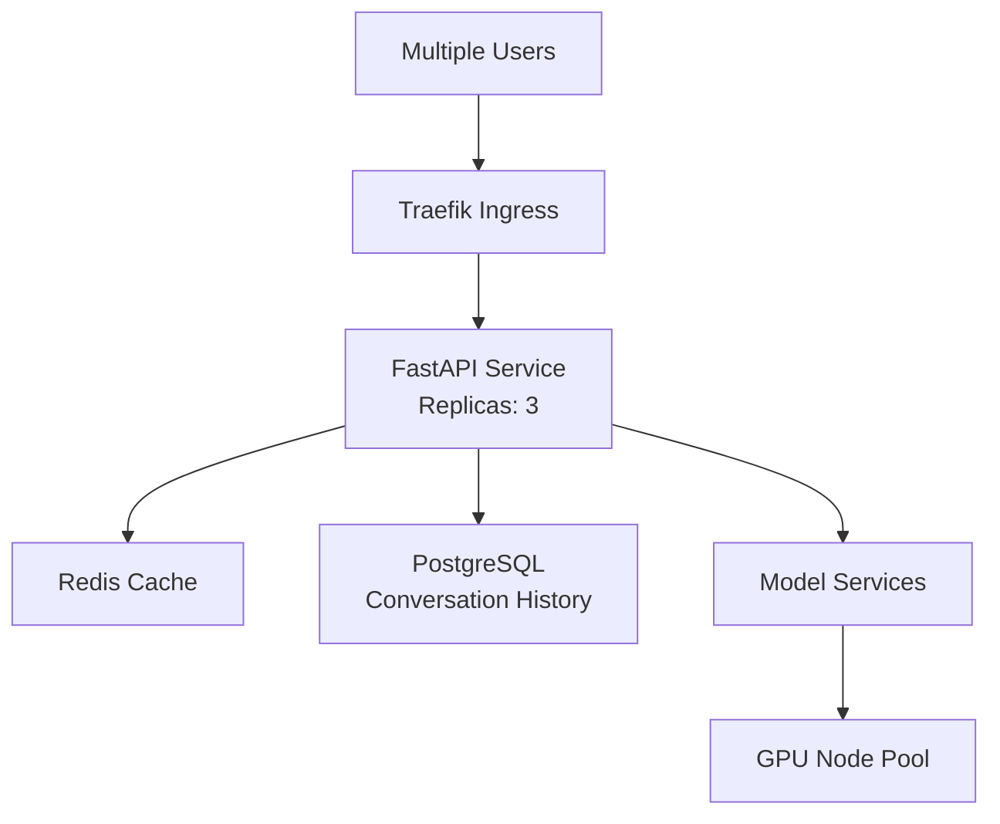

---

## License

This project is licensed under the MIT License. See `LICENSE` file for details.

---

## Acknowledgments

- **Ollama**: Provides the inference engine for all models
- **K3s**: Lightweight Kubernetes distribution by Rancher
- **Model Providers**: Meta (LLaMA), Alibaba (Qwen), Google (Gemma), IBM (Granite)
- **Python aiohttp**: Enables efficient async HTTP communication

---

## Support

For issues, questions, or feature requests:
- Open an issue on GitHub
- Check existing documentation in `/docs`
- Review troubleshooting section above

**System Status:** Production-ready for edge deployments with 2-3 worker nodes.

---

**Built with ❤️ for edge AI orchestration**
